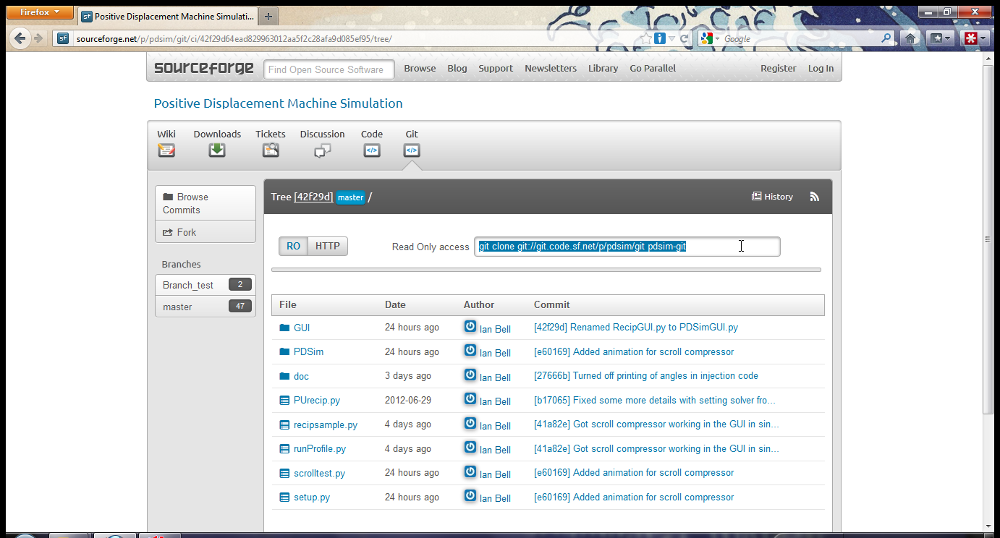

.. contents:: `Tutorial Contents`

PDSim Tutorial
==============

This tutorial will walk a windows user step-by-step through the use of PDSim on a windows platform machine

Pre-Requisites
--------------

Requirements:

- `TortoiseGit <http://code.google.com/p/tortoisegit/>`_
- `Python(x,y) <http://code.google.com/p/pythonxy/>`_ (Version 2.7.2.3 used here)
- `CoolProp` - see installation instructions in :ref:`CoolProp installation <install-PDSim>`

Optional:

- `Eclipse + pydev <http://www.eclipse.org/downloads/>`_ (pick the Eclipse IDE for C/C++ development because it is the smallest) - An integrated design environment for writing Python code.  Once Eclipse is installed, you will want the Pydev plugin.  Once Eclipse is open, go to the menu Help-->Install New Software... Click *Add...* and add http://pydev.org/updates to the sources.  Then go back and you should be able to install pydev.  Don't install mylyn integration.

Getting the necessary files
---------------------------

First go to `GIT <http://sourceforge.net/p/pdsim/git>`_ repository on Sourceforge.  There you can see the path to the repository.

    
Somewhere on your computer, right-click on a folder as below and select *Git Clone...*
    
.. image:: page002.png
    :width: 6in

then set the path to the repository and the folder on your computer where the files will be saved.  Doesn't matter what folder you select, though in general if it better to use a path without spaces.  Click the OK button, and the files will be downloaded into that folder.

.. image:: page003.png
    
Saving the files is successful
    
.. image:: page004.png

You will then need to install the PDSim module files.  To do this open a command
line prompt (Start button -> type *cmd* into the search box).  Change the directory to the directory where you installed the files.  Then run::

    python setup.py install

.. image:: page017.png

which should ultimately yield something like

.. image:: page018.png

Make sure that the last line says something like ``Writing C:\Python27\Lib\site-packages\PDSim-0.0.1-py2.7.egg-info``.  This means the files have been installed properly.
    
Running the sample files
------------------------

You have python on your computer because you installed Python(x,y).  Assuming the installation went as expected, you should be able to just browse to the folder you installed the source files and double click on the file PURecip.py and you should get a window that looks something like this:
 
.. image:: page005.png

When the run finshes you will get a window that opens with a few possible plots.  

.. image:: page006.png

Click on a button to generate a plot.  In this case, clicking on the pressure v. volume button gives

.. image:: page007.png

You can also zoom in on the plot by clicking the magnifying button and selecting a range with the mouse.

.. image:: page008.png

Doing this a few times allows you to see that at the end of the rotation there is a bit of oscillation due to the relatively high flow rate for the relatively small volume

.. image:: page009.png

Code Development
----------------
If you want to use Eclipse to do development (recommended), you will need to set up a project.  So let's go ahead and do that.  First open Eclipse - you probably won't see any projects on the left side.  If you right click in the Pydev package explorer, you can go to New... --> Project...

.. image:: page011.png
    :width: 8in
    
Then select Pydev project

.. image:: page012.png

You can call the project whatever you like.  Deselect the default workspace and select the folder where your PDSim source tree is (c:\\pdsim in the example above)

.. image:: page013.png

Don't check any of the other projects

.. image:: page014.png

You can then double-click PURecip.py to open it in the editor.

.. image:: page015.png
    :width: 8in
    
Once you have opened PURecip.py, you need to configure pydev to run the file.  Left-click the little down-arrow next to the run button, Run As... --> Python Run.

.. image:: page016.png
    :width: 8in

Which should run the example file.  You can also run the sample recip and scroll compressors by the same method.