.. contents:: `Tutorial Contents`

PDSim Tutorial
==============

This tutorial will walk a windows user step-by-step through the use of PDSim on a windows platform machine

Pre-Requisites
--------------

Requirements:

- `TortoiseGit <http://code.google.com/p/tortoisegit/>`_ Download an installer and install.  If you get errors about not having MSYS git, you can download MSYSGIT from `msysgit <http://code.google.com/p/msysgit/downloads/list?can=2&q=%22Full+installer+for+official+Git+for+Windows%22>`_
- `Python(x,y) <http://code.google.com/p/pythonxy/>`_ (Version 2.7.2.3 used here).  Download and install the full installation.  When you go to install, you need to ensure that under Packages, you have cython, wxpython, matplotlib, nose, scipy, numpy checked, and under Other, you want SciTE, WinMerge, MinGW and SWIG.
- `CoolProp` - see installation instructions in :ref:`CoolProp installation <install-PDSim>`.  The easiest solution is just to download and run the nightly build from http://sourceforge.net/projects/coolprop/files/CoolProp/Nightly/
- A C++ compiler.  If you installed MinGW from Python(x,y), you are are all set. Otherwise you can get a copy of `Microsoft Visual Studio 2008 C++ Express <http://www.microsoft.com/visualstudio/en-us/products/2008-editions/express>`_ for free and it works great
- `Eclipse + pydev <http://www.eclipse.org/downloads/>`_ (pick the Eclipse IDE for C/C++ development because it is the smallest) - An integrated design environment for writing Python code.  Once Eclipse is installed, you will want the Pydev plugin.  Once Eclipse is open, go to the menu Help-->Install New Software... Click *Add...* and add http://pydev.org/updates to the sources.  Then go back and you should be able to install pydev.  Don't install mylyn integration.

Getting the necessary files
---------------------------
    
Somewhere on your computer, right-click on a folder as below and select *Git Clone...*
    
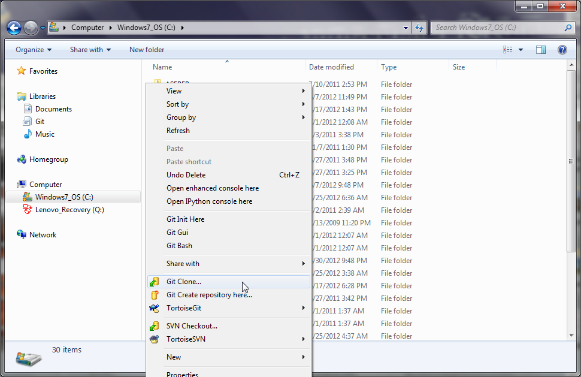

then set the path to the repository and the folder on your computer where the files will be saved.  Doesn't matter what folder you select, though in general if it better to use a path without spaces.  Click the OK button, and the files will be downloaded into that folder.

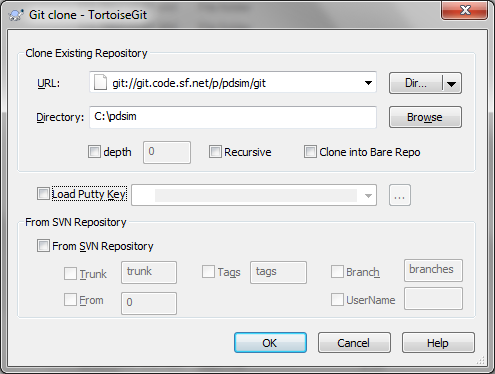
    
Saving the files is successful
    
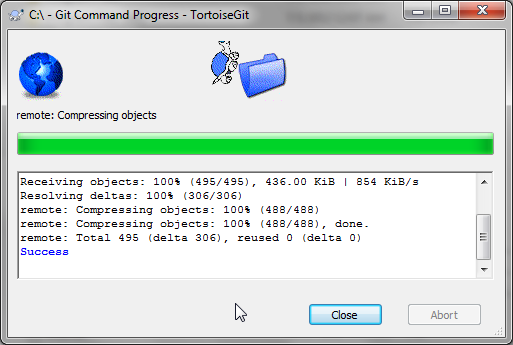

You will then need to install the PDSim module files.  The easiest solution is just to download a nightly build from http://sourceforge.net/projects/pdsim/files/Nightly/ (select the newest file), download and install it.

If you want to install PDSim from source, open a command line prompt (Start button -> type ``cmd`` into the search box).  Change the directory to the directory where you installed the files.  If you have installed MinGW as recommended above, you can install PDSim by running::

    python setup.py build --compiler=mingw32 install
    
Otherwise if you have Microsoft Visual Studio installed, you can just run::

    python setup.py install

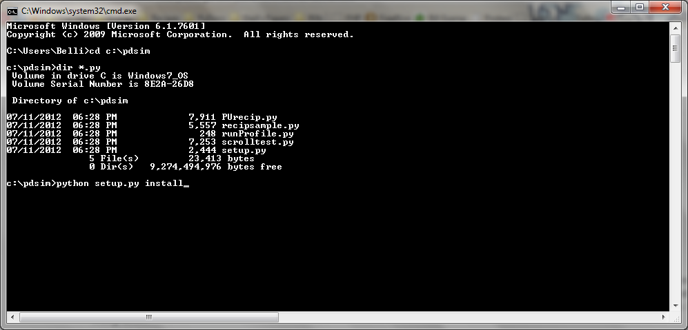

which should ultimately yield something like

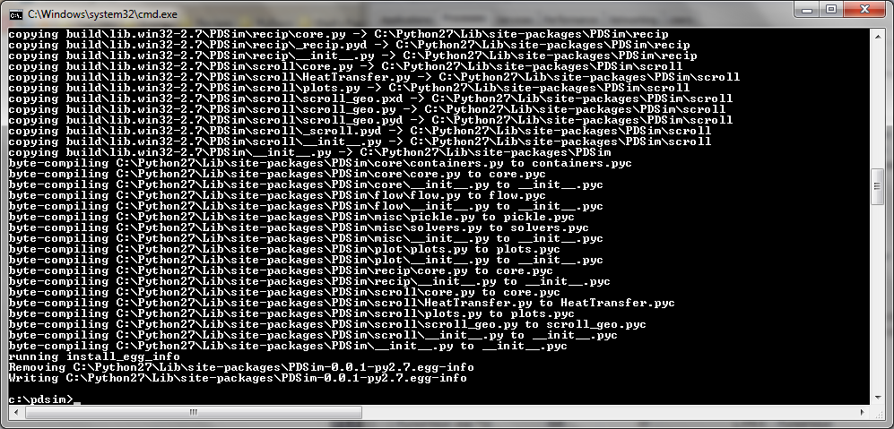

Make sure that the last line says something like ``Writing C:\Python27\Lib\site-packages\PDSim-0.0.1-py3.7.egg-info``.  This means the files have been installed properly.

Checking installed files
------------------------

If you start a command prompt and run the command ``python``, you can try to import each of the required python packages using the code below.  This will allow you to check whether all the necessary files are included, and where they have been installed to.  If none of the following commands give you errors, you are ready to proceed.

.. ipython::

    In [0]: import CoolProp,matplotlib,Cython,PDSim,wx,numpy,scipy
    
    In [0]: print(CoolProp.__file__); print(CoolProp.__version__)
    
    In [0]: print(matplotlib.__file__); print(matplotlib.__version__)
    
    In [0]: print(Cython.__file__); print(Cython.__version__)
    
    In [0]: print(PDSim.__file__); print(PDSim.__version__)
    
    In [0]: print(wx.__file__); print(wx.version())
    
    In [0]: print(numpy.__file__); print(numpy.__version__)
    
    In [0]: print(scipy.__file__); print(scipy.__version__)
    
Running the sample files
------------------------

You have python on your computer because you installed Python(x,y).  Assuming the installation went as expected, you should be able to just browse to the folder you installed the source files, go into the ``examples`` sub-folder and double click on the file PURecip.py and you should get a window that looks something like this:
 
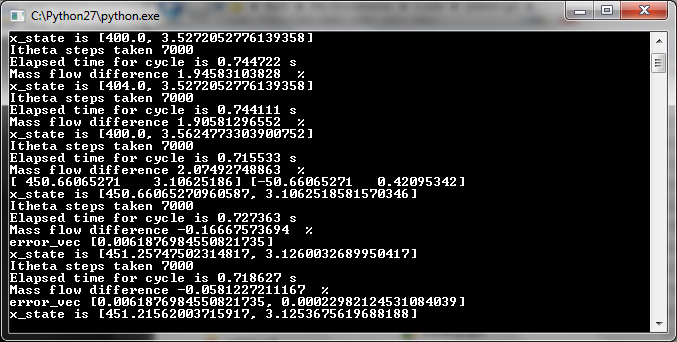

When the run finshes you will get a window that opens with a few possible plots.  

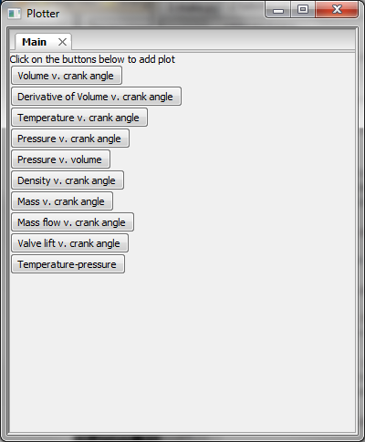

Click on a button to generate a plot.  In this case, clicking on the pressure v. volume button gives

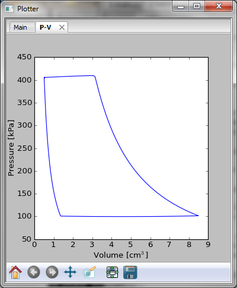

You can also zoom in on the plot by clicking the magnifying button and selecting a range with the mouse.

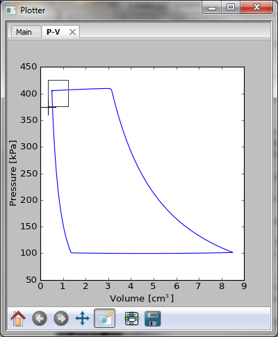

Doing this a few times allows you to see that at the end of the rotation there is a bit of oscillation due to the relatively high flow rate for the relatively small volume

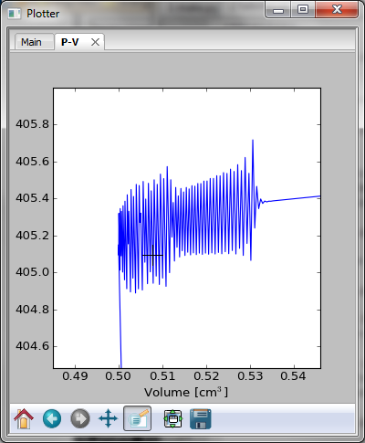

Code Development in Eclipse
---------------------------

Setup
^^^^^
The first time you start up Eclipse you may have to do a bit of configuration.  For your information, eclipse installs some files in HOME/.eclipse where HOME is the path to your home folder (``c:\Users\username`` on Windows 7)

Eclipse may ask you for a default workspace folder, just select the default and tell it to remember your choice.  This is simply where it will default to create a new project, but it's not that important and I almost never make projects in the default folder anyway.

Eclipse might not find your python installation by default, but is relatively straightforward to set up a new interpreter.  To check and/or set your python interpreter, go to Window->Preferences in the top menu.  Then expand pydev by clicking the arrow left to pydev and select ``Interpreter - Python``.  If you see your python interpreter there, you are all set and go to the next section.

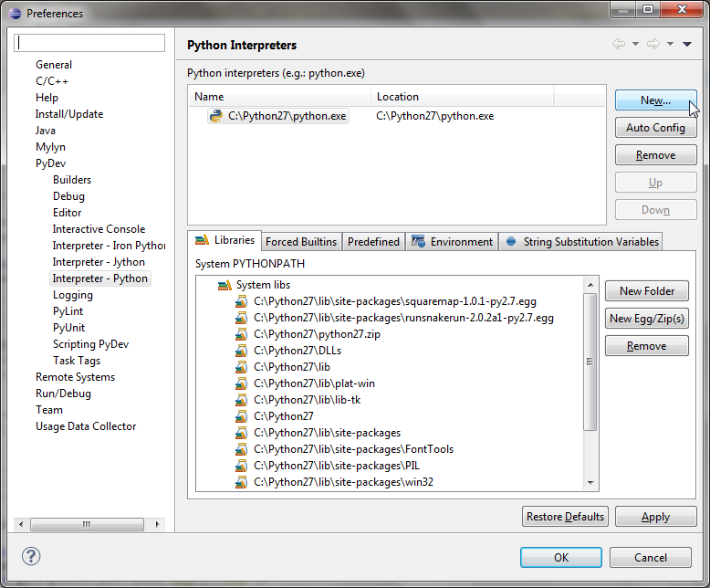
    
If you do not see your interpreter listed, you can try to click the ``Auto Config`` button and it will try to find python automatically and set up the paths.  Click the ok and give it a while to parse all your packages installed.

Using Eclipse
^^^^^^^^^^^^^
Now you will need to set up a project.  So let's go ahead and do that.  First open Eclipse - you probably won't see any projects on the left side.  If you right click in the Pydev package explorer, you can go to New... --> Project...

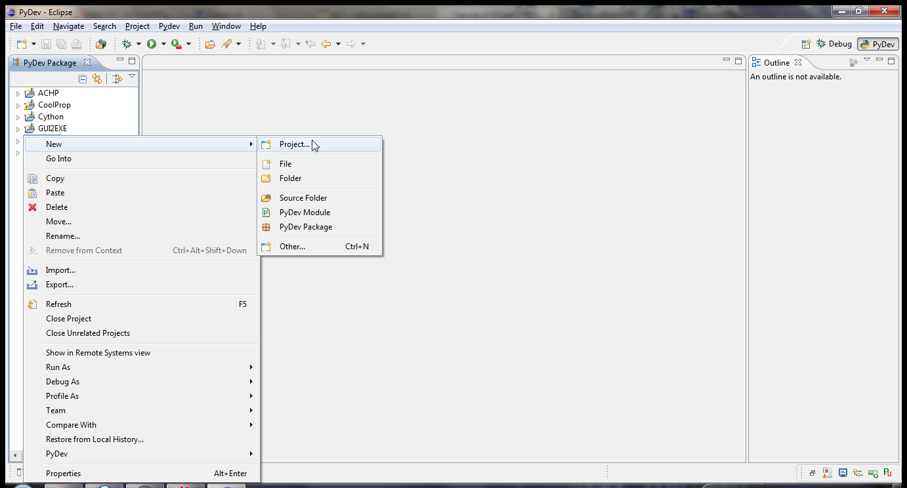
    
Then select Pydev project

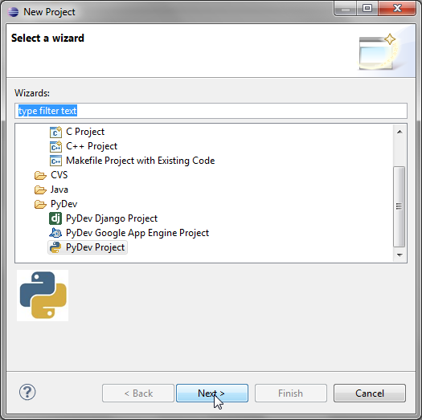

You can call the project whatever you like.  Deselect the default workspace and select the folder where your PDSim source tree is (c:\\pdsim in the example above)

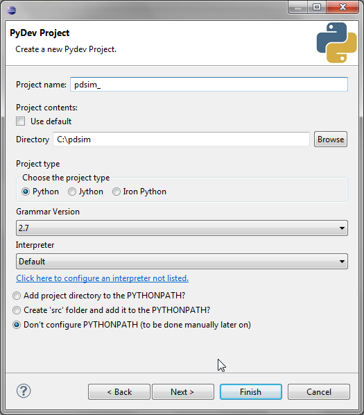

Don't check any of the other projects

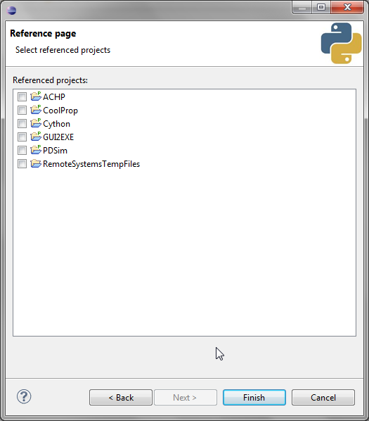

You can browse to the examples folder then double-click PURecip.py to open it in the editor.

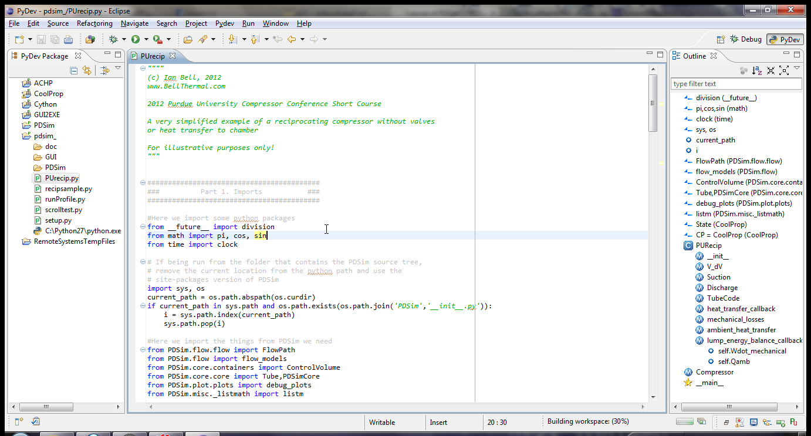
    
Once you have opened PURecip.py, you need to configure pydev to run the file.  Left-click the little down-arrow next to the run button, Run As... --> Python Run.

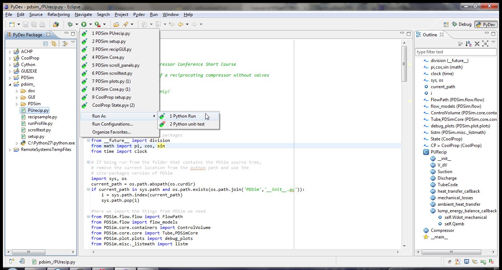

Which should run the example file.  You can also run the sample recip and scroll compressors in the same folder by the same method.